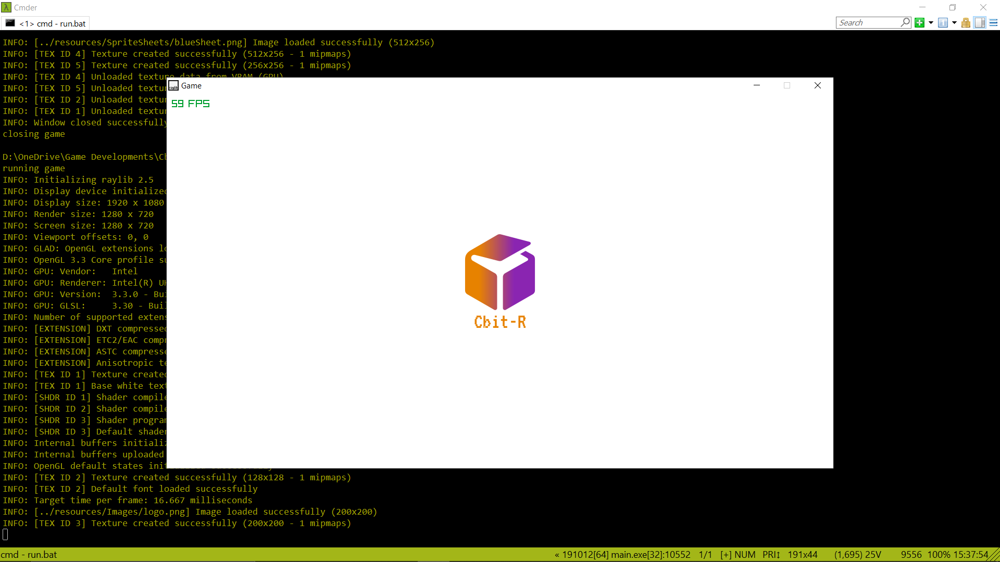

# Cbit Game Engine 2.0

### All code and material is get from
1. Raylib Engine as main game engine
- [Raylib homepage](https://www.raylib.com/index.html)
- [Raylib Cheatsheet page](https://www.raylib.com/cheatsheet/cheatsheet.html)
- [Raylib Examples page](https://www.raylib.com/examples.html)
2. ECS from BirchEngine
- [Birch Engine github page](https://github.com/carlbirch/BirchEngine/)
3. SFML RPG from HeadTurna
- [SFML RPG github page](https://github.com/Headturna/SFML_RPG)
4. That Game Guy
- [That Game Guy Homepage](http://thatgamesguy.co.uk/game-engine-dev/)
- [Github page](https://github.com/thatgamesguy/that_game_engine)

### TODO
1. Clean code base
19/12/2019
- Cursor class : Use to customize cursor
- Tile Map class : To show tile map
- Collison detection mechanic (collider2d / collision2d) 
- Destroy mechanic
- Entity Manager : Manage all entities in the scene
- Camera (2d & 3d) 

### Done
11/12/2019 - Add Button Component, 

### Unsolved implementation
18/12/2019 
- Still cannot implement resources allocator or asset manager
- Need to understand about pointer
- Change cursor image
